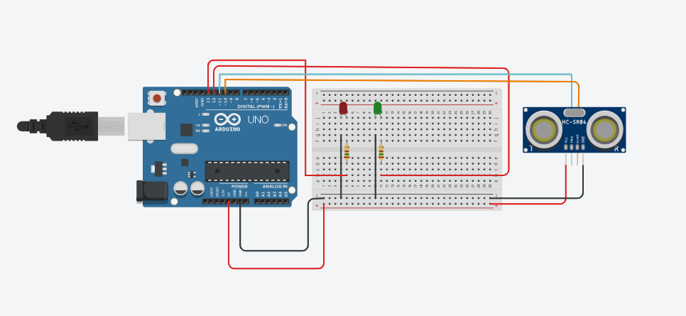

# 🚗 Identificador de Vagas de Estacionamento (Smart Parking)

Este projeto foi desenvolvido como um experimento de Robótica Educacional para simular o funcionamento de um sistema de estacionamento inteligente. Ele utiliza sensores ultrassônicos para detectar a presença de veículos e fornecer feedback visual em tempo real.

## 🎯 Objetivos Pedagógicos
- Compreender o funcionamento do sensor ultrassônico (HC-SR04).
- Aplicar lógica de programação condicional (`if/else`) para tomada de decisão.
- Trabalhar com sinalização visual utilizando LEDs para representar estados do sistema (Livre/Ocupado).

## 🛠️ Componentes Utilizados
- **Microcontrolador:** Arduino Uno R3
- **Sensor de Distância:** Ultrassônico HC-SR04
- **Atuadores Visuais:** 01 LED Verde (Vaga Livre) e 01 LED Vermelho (Vaga Ocupada)
- **Resistores:** 02 resistores de 220Ω
- **Protoboard e Jumpers**

## 🔌 Esquema do Circuito


## 📖 Funcionamento do Sistema
O sistema funciona baseado na leitura da distância entre o sensor e o objeto (carro):
1. O sensor emite uma onda sonora e mede o tempo de retorno.
2. O código calcula a distância em centímetros.
3. **Lógica de Verificação:**
   - **Distância < 100cm:** O sistema entende que há um veículo na vaga. O **LED Vermelho** acende.
   - **Distância > 100cm:** O sistema entende que a vaga está disponível. O **LED Verde** acende.

## 💻 Código-Fonte
O arquivo principal `.ino` está localizado na mesma pasta deste arquivo. Abaixo, um trecho da lógica principal:

```cpp
// Definição da lógica de detecção
if (distancia <= 100) {
  digitalWrite(ledVermelho, HIGH);
  digitalWrite(ledVerde, LOW);
} else {
  digitalWrite(ledVermelho, LOW);
  digitalWrite(ledVerde, HIGH);
}
