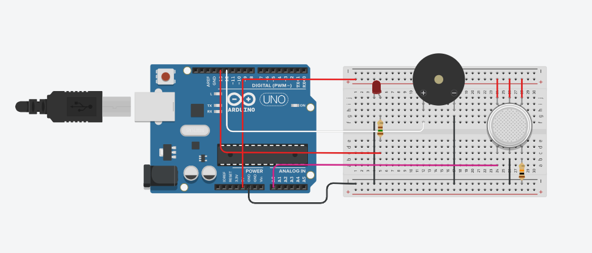

# 🔥 Detector de Vazamento de Gás (Alerta de Segurança)

Este projeto foi desenvolvido como um sistema de segurança doméstica utilizando Robótica Educacional. O objetivo é detectar a presença de gases inflamáveis (como GLP ou fumaça) e emitir alertas sonoros e visuais imediatos.

## 🚀 Simulação Online
Teste o funcionamento do circuito e veja a lógica de detecção no link abaixo:
👉 https://www.tinkercad.com/things/jV8JXQM2Y0x-identificador-de-vazamentos-de-gas?sharecode=fNQc4gWVzs8Xh7aLZcBluQ-nX_kqOO0YcL-8VmyLTm0

---

## 🎯 Objetivos Pedagógicos
- Entender o funcionamento de sensores analógicos (Sensor de Gás).
- Trabalhar com calibração de limites de segurança (Thresholds).
- Desenvolver a lógica de alerta usando saídas sonoras (Buzzer) e visuais (LEDs).

## 🛠️ Componentes Utilizados
- **Microcontrolador:** Arduino Uno R3
- **Sensor:** Sensor de Gás/fumaça
- **Atuador Sonoro:** 01 Buzzer Ativo
- **Atuadores Visuais:** 01 LED Vermelho (Alerta)
- **Resistores:** 01 resistores de 220Ω e 01 resistor de 10kΩ (para o sensor)

## 🔌 Esquema do Circuito



## 📖 Como funciona
1. O sensor realiza a leitura constante da qualidade do ar ambiente.
2. Os dados são enviados ao Arduino via porta Analógica.
3. **Lógica de Segurança:**
   - **Gás detectado (Acima do limite):** O **LED Vermelho** pisca e o **Buzzer** emite um som intermitente de alerta.


## 💻 Código-Fonte
O código completo `.ino` está nesta pasta. Abaixo, a lógica principal de controle:

```cpp
void loop() {
  int valorGas = analogRead(A0); // Lê a concentração de gás

  if (valorGas > limiteSeguranca) {
    digitalWrite(ledVermelho, HIGH); // Ativa alerta visual
    tone(buzzer, 1000);              // Ativa alerta sonoro
  } else {
    digitalWrite(ledVermelho, LOW);  // Desativa alerta visual
    noTone(buzzer);                  // Desativa alerta sonoro
  }
}
