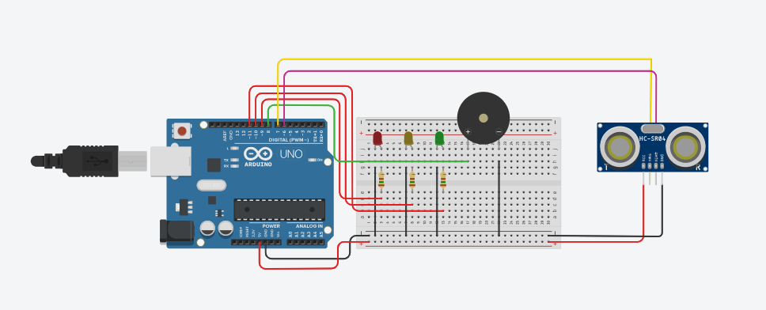

# 🚗 Sensor de Distância com Alerta Visual e Sonoro

Este projeto utiliza um sensor ultrassônico **HC-SR04** para medir a distância de obstáculos e fornecer feedback em tempo real por meio de um **sistema de semáforo (LEDs)** e **alerta sonoro (Buzzer)**.

O projeto simula um sistema simples de **segurança e proximidade**, muito comum em aplicações como sensores de estacionamento e projetos de **robótica educacional**.

---

## 🚀 Simulação Online

Você pode testar e visualizar o funcionamento do projeto diretamente no navegador através do Tinkercad:

👉 https://www.tinkercad.com/things/ibp7zdMMrSW-sensor-de-distancia

---

## 🛠️ Componentes Utilizados

- **Microcontrolador:** Arduino Uno  
- **Sensor:** HC-SR04 (Ultrassônico)  
- **Saídas Visuais:**  
  - LED Verde (Seguro)  
  - LED Amarelo (Atenção)  
  - LED Vermelho (Perigo)  
- **Saída Sonora:** Buzzer Piezoelétrico  
- **Resistores:** 3 × 220Ω  
- **Protoboard e Jumpers**

---

## 🔌 Esquema do Circuito



---

## 📖 Funcionamento do Sistema

1. O sensor ultrassônico HC-SR04 mede a distância até um obstáculo.
2. O Arduino processa os dados recebidos do sensor.
3. De acordo com a distância medida, o sistema reage da seguinte forma:

| Distância Detectada | Estado | Ação |
|--------------------|--------|------|
| Maior que 300 cm | ✅ Seguro | LED Verde ligado |
| Entre 100 e 300 cm | ⚠️ Atenção | LED Amarelo ligado |
| Menor ou igual a 100 cm | 🚨 Perigo | LED Vermelho piscando e Buzzer ativado |

Este comportamento permite uma resposta visual e sonora clara conforme o objeto se aproxima do sensor.

---

## 💻 Código-Fonte

O código completo do projeto está disponível neste repositório.  
Abaixo está um trecho da **lógica principal de controle** utilizada no Arduino:

```cpp
if (distancia > 300) {
  digitalWrite(11, HIGH); // LED Verde (Seguro)
  noTone(8);              // Buzzer desligado
} 
else if (distancia > 100) {
  digitalWrite(10, HIGH); // LED Amarelo (Atenção)
  noTone(8);
} 
else {
  digitalWrite(9, HIGH);  // LED Vermelho (Perigo)
  tone(8, 523, 1000);     // Alerta sonoro
}
