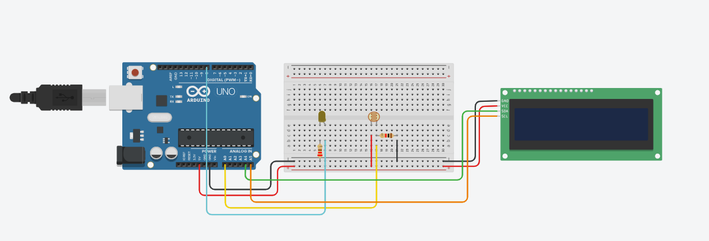

# 💡 Sensor de Luminosidade com LCD (Arduino)

Projeto de **Robótica Educacional** que utiliza um fotoresistor para medir o nível de luminosidade do ambiente e exibir mensagens informativas em um **display LCD 16x2 com interface I2C**.  
O sistema informa se o ambiente está claro ou escuro e acende um led simulando aplicações como iluminação automática.

---

## 🎯 Objetivo do Projeto
- Compreender o funcionamento do **sensor de luminosidade (LDR)**
- Trabalhar com **leitura analógica** no Arduino
- Exibir informações em **LCD I2C**
- Aplicar **lógica condicional (if/else)** para tomada de decisão
- Integrar sensores e atuadores em um sistema simples

---

## 🛠️ Componentes Utilizados
- Arduino Uno  
- Sensor de Luminosidade (LDR)  
- Display LCD 16x2 com módulo I2C  
- Resistores  
- Protoboard  
- Jumpers
- Led

---

## 🔌 Esquema do Circuito
O LDR é conectado a uma entrada analógica do Arduino, formando um divisor de tensão.  
O display LCD utiliza comunicação **I2C**, necessitando apenas dos pinos:

- **SDA**
- **SCL**
- **VCC**
- **GND**



---

## 🚀 Simulação Online
Você pode testar e visualizar o funcionamento deste projeto diretamente no navegador:
👉 https://www.tinkercad.com/things/a9xpEkXrmDs-sensor-de-luminosidade?sharecode=Yl_EjQQtDIbluYCQIIFw6G1Vk9mrseV84SAsfvwq-vs

---

## ⚙️ Funcionamento
1. O Arduino realiza a leitura do valor analógico do LDR  
2. O valor é comparado com um limite pré-definido  
3. O sistema exibe no LCD mensagens como:
   - **“Luz baixa – luz acesa!”**
4. Led acende

---

## 💻 Código
O código completo do projeto está disponível neste repositório.
Abaixo está um trecho da lógica principal usada no programa:

```cpp
// leitura do sensor de luminosidade
valorLuz = lerSensor();

// verificação do nível de luz
if (valorLuz < limite) {
    exibirMensagem("Luz baixa");
    exibirMensagem("Luz acesa!");
} else {
    exibirMensagem("Ambiente claro");
}

