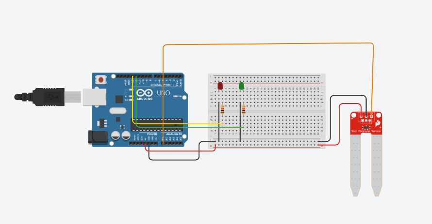

# 🪴 Monitor de Umidade de Solo Inteligente

## Sobre
Projeto desenvolvido como experimento de **Robótica Educacional** para simular o monitoramento da hidratação de plantas. Utiliza um **sensor de umidade de solo analógico** para detectar o estado do solo e fornecer **feedback visual em tempo real** por meio de LEDs.

## Simulação
O projeto pode ser testado diretamente no navegador através do Tinkercad:  
👉 https://www.tinkercad.com/things/hpZXp5pk3lg-projeto-sensor-de-umidade?sharecode=2DmjMTskPsJgY_8oANBasrzixq8QFXCsuGJ90Bx2VZo

## objetivos
- Compreender o funcionamento do sensor de umidade de solo analógico  
- Aplicar lógica condicional (`if/else`) baseada em leituras analógicas  
- Representar estados do sistema com LEDs (Solo Seco / Solo Úmido)

## componentes
Arduino Uno R3
sensor de umidade de solo (analógico)
LED vermelho (solo seco) 
LED verde (solo úmido) 
dois resistores para proteção dos LEDs
protoboard e jumpers.

## Circuito


## Funcionamento
O sensor realiza a leitura analógica da umidade do solo e exibe o valor no Monitor Serial.  
A lógica adotada é simples:
- **Leitura ≤ 300:** solo seco → LED vermelho ligado  
- **Leitura > 300:** solo úmido → LED verde ligado  

Essa abordagem facilita a visualização prática do uso de sensores analógicos em sistemas automatizados.

## Código
O código realiza leituras contínuas do sensor com um pequeno intervalo de **10 ms** para estabilidade, o código completo pode ser encontrado na pasta do projeto, mas a lógica é a seguinte:

```cpp
if (analogRead(A0) <= 300) {
    digitalWrite(12, HIGH); // Solo Seco
    digitalWrite(13, LOW);
} else {
    digitalWrite(12, LOW);
    digitalWrite(13, HIGH); // Solo Úmido
}
